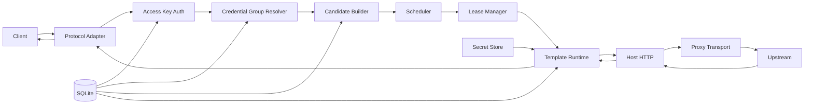

# 02 — 总体架构

## 1. 组件图



## 2. 模块职责

### protocol

负责 route、model、stream、session metadata、Client Key 的提取，并保留 raw request。  
不负责 Provider-specific rewrite、上游 endpoint 决策或 quota。

### auth

输入 Client API Key，输出：

```text
AccessKeyRecord + CredentialGroupID
```

### routing/candidate

- 展开 Group.templateIds
- 查询 instances
- 做静态 model/protocol filter
- 调用 Template `supports`
- 构造 CandidateSnapshot

### scheduler

输入 RequestRoutingContext 和 CandidateSnapshot，输出一个候选 instanceId。

### lease

保证 select + activeRequests++ 原子。

### runtime

- 加载并编译指定 Template Version
- 合并 fields
- 暴露 Host API
- 执行 hooks
- enforce timeout/capability

### transport

- HTTP direct
- HTTP proxy
- CONNECT
- cancellation
- stream copy
- optional SOCKS5

### store

SQLite persistence、optimistic concurrency、transaction、JSON state。

### secrets

encrypt/decrypt/redaction。

## 3. 请求阶段

```text
Ingress
  |
  +-- Parse
  +-- Auth
  +-- Build candidates
  +-- Acquire scheduling lock
  |     +-- snapshot active leases
  |     +-- score
  |     +-- select
  |     +-- create lease
  +-- Release scheduling lock
  |
  +-- Runtime execute
  +-- Upstream
  +-- stream/response
  +-- hooks
  +-- release lease
```

## 4. 快路径原则

调度锁内禁止 JS execution、HTTP/DNS、DB writes、大 JSON parsing、model discovery。锁内仅允许内存 snapshot、排序/选择和 lease mutation。
